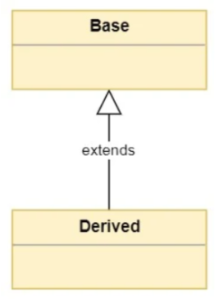
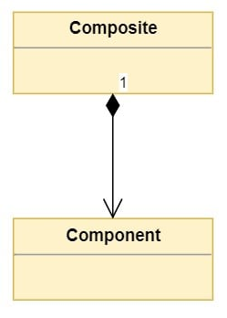

# Inheritance and Composition
Both of them enable code reuse, but they do it in different ways.

## Inheritance
Inheritance models what is called an is a relationship. <i>Derived</i> <b>is a</b> specialized version of <i>Base</i>.
- eg, <i>Horse</i> <b>is an</b> <i>Animal</i>
- Horse inherits the interface and implementation of Animal and Horse objects can be used to replace Animal objects in the application. (Liskov substitution principle)

  

In an inheritance relationship:

- Classes that inherit from another are called derived classes, subclasses, or subtypes.
- Classes from which other classes are derived are called base classes or super classes.
- A derived class is said to derive, inherit, or extend a base class.
## Composition
Composition is a concept that models a has a relationship. <i>Composite</i> <b>has a</b> <i>Component</i>
- eg, <i>Horse</i> <b>has a</b> <i>Tail</i>. 
- Both Horse and Dog classes can leverage the functionality of Tail through composition without deriving one class from the other.

  

In the diagram above, the 1 represents that the Composite class contains one object of type Component. Cardinality can be expressed in the following ways:

- A number indicates the number of Component instances that are contained in the Composite.
- The * symbol indicates that the Composite class can contain a variable number of Component instances.
- A range 1..4 indicates that the Composite class can contain a range of Component instances. The range is indicated with the minimum and maximum number of instances, or minimum and many instances like in 1..*.

## Note
Every class that you create in Python will implicitly derive from object. 
The exception to this rule are classes used to indicate errors by raising an exception 
which must be derived from the class <i>BaseException</i>.